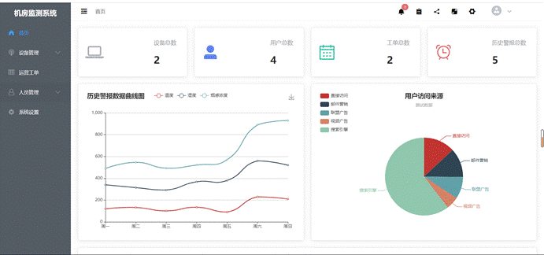
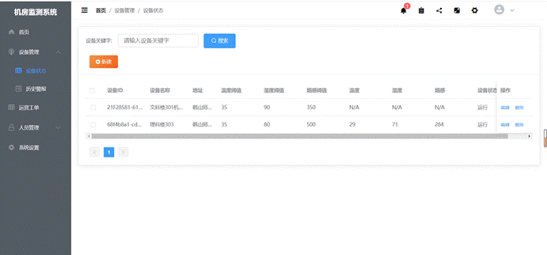
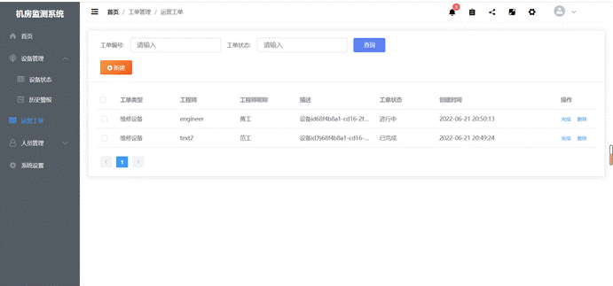
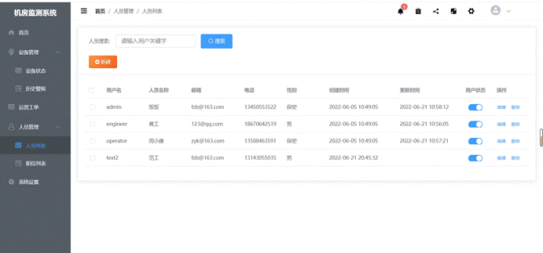
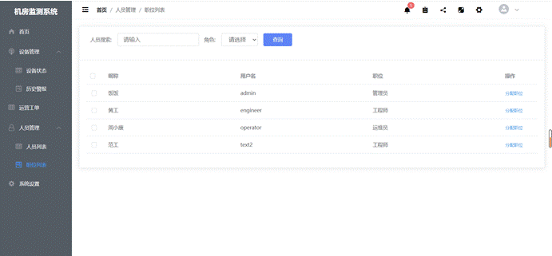

<h2 align="center">机房监测系统</h2>
<div align="center">
  <a href="https://github.com/vuejs/vue">
    
  </a>
  <a href="https://github.com/ElemeFE/element">
    
  </a>
  <a href="https://www.echartsjs.com/zh/index.html">
    
  </a>
  <a href="https://github.com/dongdong-cloud/dd-admin-web">
    
  </a>
</div>

Monitoring system 是一个前端解决方案，基于 vue 2 和 element-ui 2.12.0 开发的后台管理系统。功能实时记录多台设备温度、湿度、烟雾浓度，超过阈值报警提示，管理工单，用户，设备等多种丰富组件。


### 功能简介
-----

- 登录 / 注销

- 动态路由
  - 登录验证
  - 权限控制（开发中）
- 全局功能
  
  (1)   用户权限
  
  使用本系统，可以建立不同的角色人员，每个角色的权限不同，初始登录默认使用管理员。
  
  (2)   新增设备
  
  管理员用户，工程师用户可进行登录使用该系统，可以在PC端登录系统实后可新增设备信息，并对设备地理位置记录。
  
  (3)   修改设备
  
  管理员用户可进行登录使用该系统，可以在PC端登录系统实后可对指定设备信息进行修改，并对设备地理位置记录。
  
  (4)   阈值设定
  
  管理员用户可进行登录使用该系统，可以在PC端登录系统实后可对指定设备的传感器进行设置阈值，待实时监测的数据超过设定阈值就会产生对应警报信息。
  
  (5)   远程监控
  
  用户可使用该系统，可以在PC端登录系统实时的查看多态设备相关监测数据（如温度、湿度、烟雾浓度等）。
  
  (6)   异常提示
  
  在本系统，可监测多态设备的数据，设备数据异常时，系统会自动做出提示报警设备的异常，并产生报警信息记录。
  
  (7)   异常处理
  
  用户可以通过新建维修工单工单选择对应的维护人员对该设备进行维修处理。
  
  (8)      工单处理
  
  用户可使用该系统，可以在PC端登录系统实后新建类型工单，分为安装工单与维修工单，还可对已完成的工单的状态进行修改。
  
  (9)   人员管理
  
  管理员用户登录的权限下，可以看到用户列表，对用户列表进行一系列的相关操作处理。

### 演示地址
-----

演示地址 

### 系统截图

系统首页

https://raw.githubusercontent.com/UnravelF/MonitorSystem/master/README.assets/clip_image002.gif



多设备监测

https://raw.githubusercontent.com/UnravelF/MonitorSystem/master/README.assets/clip_image002-16574374956183.gif



设备预警与报警记录

https://raw.githubusercontent.com/UnravelF/MonitorSystem/master/README.assets/clip_image002-16574375314485.gif


工单管理

https://raw.githubusercontent.com/UnravelF/MonitorSystem/master/README.assets/clip_image002-16574375542857.gif



人员管理

https://raw.githubusercontent.com/UnravelF/MonitorSystem/master/README.assets/clip_image002-16574375671909.gif



职位管理

https://raw.githubusercontent.com/UnravelF/MonitorSystem/master/README.assets/clip_image002-165743758100011.gif




### 安装步骤
-----

``` bash
# 安装依赖
npm install

# 访问地址 localhost:8088
npm run dev

# 编译打包
npm run build
```

### 目录结构
-----


### 浏览器兼容
-----

| [](http://godban.github.io/browsers-support-badges/)<br>IE / Edge | [](http://godban.github.io/browsers-support-badges/)<br>Firefox | [](http://godban.github.io/browsers-support-badges/)<br>Chrome | [](http://godban.github.io/browsers-support-badges/)<br>Safari | [](http://godban.github.io/browsers-support-badges/)<br>Opera |
| --------- | --------- | --------- | --------- | --------- |
| IE11, Edge| last 2 versions| last 2 versions| last 2 versions| last 2 versions

### 捐赠
---
项目的创作离不开您的支持，如果你觉得此项目能够帮助到您，不如点个star支持作者吧， 谢谢！

---
本项目部分灵感来源于其他开源项目el-admin 、imcoder-cloud/imcoder-admin

[https://github.com/imcoder-cloud/imcoder-admin]()